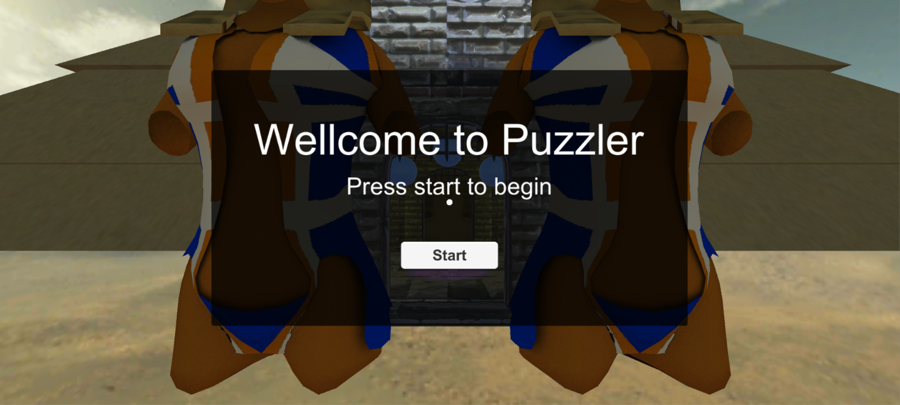
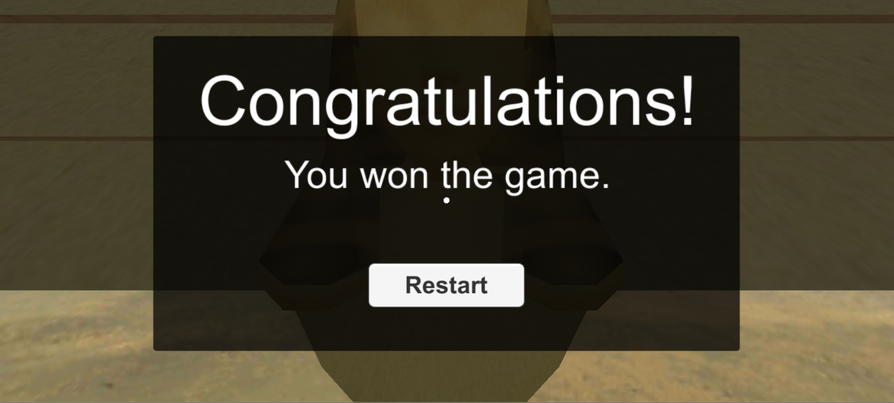

# Puzzler Project

## Introduction

This project is part of [Udacity](https://www.udacity.com "Udacity - Be in demand")'s [VR Developer Nanodegree](https://www.udacity.com/course/vr-developer-nanodegree--nd017).

The project consists on design and develop a simple puzzle Virtual Reality application, using Unity and GoogleVR, with the objective of learn VR desing, development and project management.

This document contains the specifications of the mentioned application and some information about the project schedule.

## Demo video

## Scenes

### Start Scene

### Play Scene

### End Scene

## Project Schedule

### Iteration 1

## Third Party Software

- Unity 2017.2.0f3
- GVR Unity SDK v1.60.0
- iTween v2.0.7