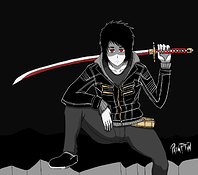
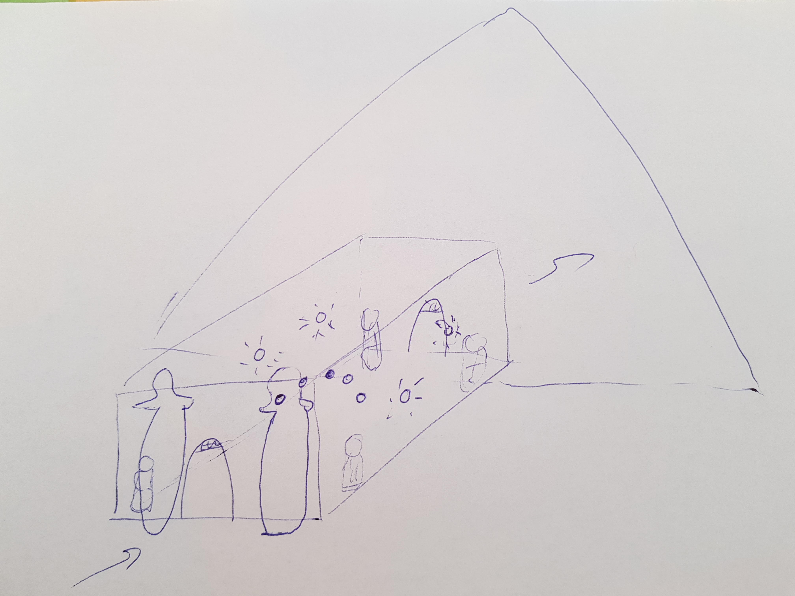
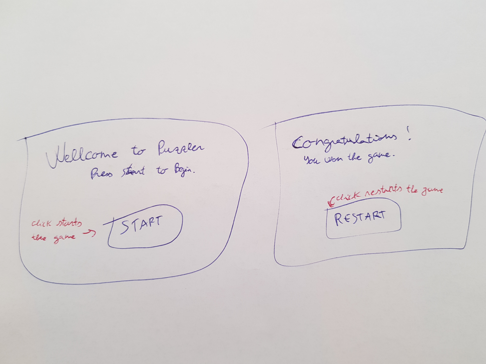

# Puzzler Project

## Introduction

This project is part of [Udacity](https://www.udacity.com "Udacity - Be in demand")'s [VR Developer Nanodegree](https://www.udacity.com/course/vr-developer-nanodegree--nd017).

The project consists on design and implement a simple puzzle Virtual Reality application, using Unity and GoogleVR, with the objective of learn VR design, development and project management.

This document contains the specifications of the mentioned application and some information about the project schedule.

## Demo video

## Scenes

### Start Scene

### Play Scene

### End Scene

## Project Schedule

### Iteration 1: Analysis

This iteration consisted of analyze the potential players for our game, design the scenes and the GUI.

#### Persona

Jordi, 25 - Computer Science, University Student

“I love gaming”

Jordi is a videogame passionate. He is studying Computer Science at the university to become an excellent video game developer.

VR experience: Tried only once in a university VR demo.

#### Game Sketch

#### GUI Sketch

### Iteration 2: Scene

This iteration consisted of implement the 3D scene and the lighting.

#### Test questions

- There is any object that is oversized, undersized?
- How do you feel with the atmosphere of the game? Where do you thing are you placed?
- There is any object that is not correctly visualized?
- Do you see any zone that is too dark appreciate it?
- Do you see any zone that is too shiny and causes you sickness?

### Iteration 3: GUI

This iteration consisted of implement the start and restart GUI dialogs.

#### Test questions

- Can you read comfortably the text of the dialogs?
- Do you understand what the button does when is clicked?

### Iteration 4: Navigation system

This iteration consisted of implement the player navigation system.

#### Test questions

- Does it feel like you are going to hit a wall?
- The movement causes you sickness or makes the environment look fuzzy?

### Iteration 5: Game mechanic

This iteration consisted of implement the puzzle orbs behavior and sounds.

#### Test questions

- Do you understand what to do with the orbs?
- Is the orb sequence demonstration too quick or slow for you?
- Do you finished the game?
- How many fails you got?

## Third Party Software

- Unity 2017.2.0f3
- GVR Unity SDK v1.60.0
- iTween v2.0.7