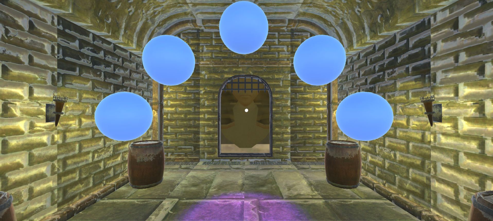

# Puzzler Project

This project is part of [Udacity](https://www.udacity.com "Udacity - Be in demand")'s [VR Developer Nanodegree](https://www.udacity.com/course/vr-developer-nanodegree--nd017).

## Introduction

## Demo video

## Scenes

### Start Scene

### Play Scene

### End Scene

## Third Party Software

- Unity 2017.2.0f3
- GVR Unity SDK v1.60.0
- iTween v2.0.7